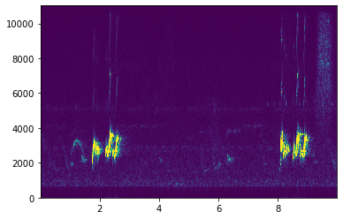
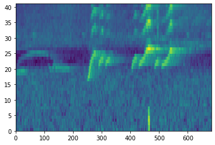
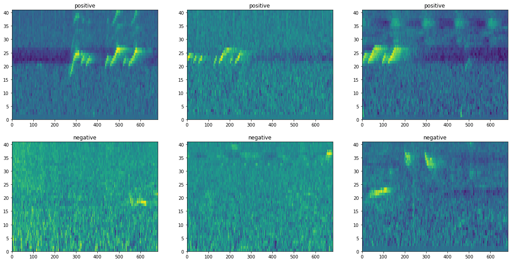
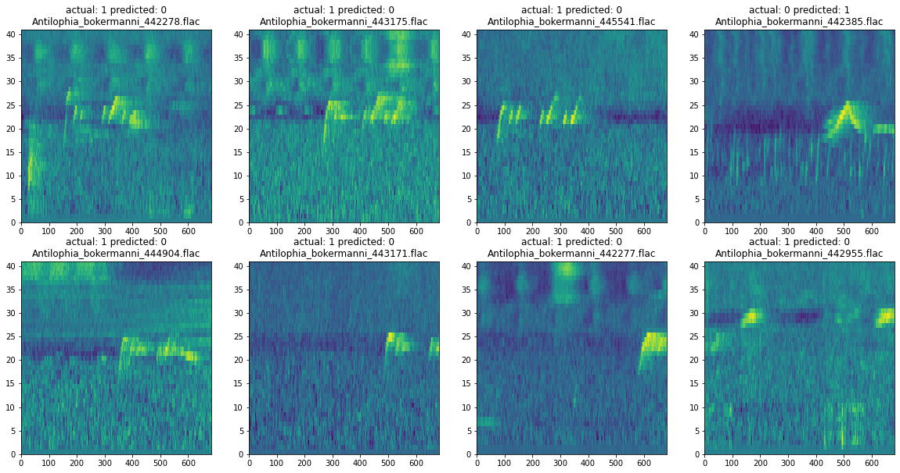
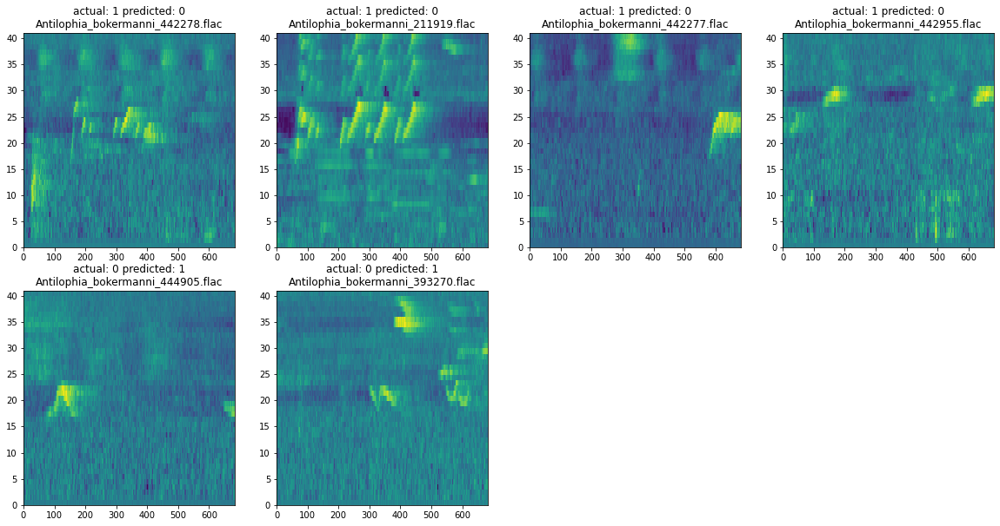

## Tutorial: Accurate Bioacoustic Species Detection from Small Numbers of Training Clips Using the Biophony Model
<br>
<div style="width: 400px">
  
    <a href="https://commons.wikimedia.org/wiki/File:Araripe_Manakin_(1).jpg" title="via Wikimedia Commons">Rick elis.simpson</a> / <a href="https://creativecommons.org/licenses/by-sa/3.0">CC BY-SA</a>
</div>
</br>

The Araripe Manakin (<i>Antilophia bokermanni</i>) is one of the rarest birds in the world, found only in a tiny forested valley in Brazil at the base of the Araripe Plateau. This critically endangered species, first discovered in 1996, was pushed to the brink of extinction through habitat destruction as settlements encroach on the last remaining forested areas [(for more info)](http://datazone.birdlife.org/species/factsheet/araripe-manakin-antilophia-bokermanni). AI-fueled automatic bird call recognition (bioacoustic monitoring) is an important new tool for locating and restoring the health of such elusive species populations, but the accuracy of such systems inherently suffers from a lack of sufficient audio examples of the species to learn from.

[Conservation Metrics](http://conservationmetrics.com/), in collaboration with [Microsoft AI for Earth](http://aka.ms/aiforearth), is developing tools for accelerating bioacoustic monitoring with AI.  This repository hosts some of those tools and demonstrates their application to new data.


# **Introduction**
This tutorial demonstrates how to quickly develop an automated system to detect the sounds of a species of interest using only a handful of short clips exemplifying the species.  For this tutorial we will build a detector for an endangered bird called the [Araripe Manakin](https://www.iucnredlist.org/species/22728410/23753034). The approach gets a leg up from the provided "starter kit" for the detection of complex species sounds. This starter kit employs Conservation Metrics' (CMI) Biophony Model, which encapsulates generalized bio-acoustic features extracted from hundreds of thousands of audio examples of more than 300 species by CMI, using techniques adapted from the computational field of Deep Learning.

This tutorial starts from scratch walking the reader through how to prepare audio data in order to train a powerful but lightweight detector, and then to deploy the detector to detect new, previously unseen examples of the species (known as *inference*).

Using only the Biophony Model and the open source `Python` toolkit `scikit-learn`, this tutorial trains in a matter of seconds a lightweight signal classifier called a Support Vector Machine (SVM). The resulting system is able detect the presence of 91% of the Araripe Manakin calls in previously unheard two-second clips, a relative improvement of greater than 76% over what is possible without the assistance of the Biophony Model.

## Araripe Manakin *Antilophia bokermanni*
The Araripe Manakin (*Antilophia bokermanni*) is a critically endangered bird from the family of manakins (Pipridae) and its population is thought to number only 800 individuals. It was discovered in 1996, scientifically described in 1998, and only found in a tiny area of forested valley at the base of the Araripe Plateau, Brazil. For more information please visit [Aquasis' website](http://aquasis.org/soldadinho/?lang=en), a local conservation organization working to protect the species and unique habitats it inhabits, and [American Bird Conservancy](https://abcbirds.org/save-the-araripe-manakin/#:~:text=In%202014%2C%20ABC%20helped%20Aquasis,Alliance%20for%20Zero%20Extinction%20species.&text=By%20donating%20today%2C%20you%20can,creeks%20found%20within%20are%20preserved). 

## Passive Acoustic Monitoring for Conservation
Acoustic recordings are an important conservation tool, providing metrics of activity and relative abundance over space and time.  These metrics can inform land managers and wildlife biologist when making conservation decisions. Passive acoustic monitoring equipment such as [AudioMoths](https://www.openacousticdevices.info/), [BAR](https://frontierlabs.com.au/) and [SongMeters](https://www.wildlifeacoustics.com/products/song-meter-sm4) can collect thousands of hours of recordings, creating a need for efficient and effective techniques to process those data.

## Getting Started
The `Jupyter` notebook that accompanies this page can be found [here](https://github.com/microsoft/acoustic-bird-detection/blob/master/cmi-antbok.ipynb).

If you want to train a detector with your own data, but do not have labeled data yet, a workflow for labeling acoustic events has been made available. An `R markdown` document with that workflow can be found [here](https://github.com/microsoft/acoustic-bird-detection/blob/master/labeling/Xenocanto_labeling_workflow_RNotebook.Rmd) and the rendered tutorial [here](https://github.com/microsoft/acoustic-bird-detection/blob/master/labeling/Xenocanto_labeling_workflow_RNotebook.md).

We recommend that you start by cloning this repo, creating a virtual environment (either with `conda` or `venv`) and launch the `jupyter notebook` directly.

------------------------------------------------------------------------------


# Prepare your envrionment and launch the `Jupyter Notebook`

```
git clone https://github.com/microsoft/acoustic-bird-detection.git
conda create -n birdsounds python=3.7
conda activate birdsounds
cd acoustic-bird-detection
pip install -r requirements.txt
jupyter notebook cmi-antbok.ipynb 
```

# Download the Starter Kit

The following code can be used to obtain the Biophony Model starter kit and import the necessary packages into the `Python` environment.


```python
# uncomment the lines below if you are running the notebook in a hosted environment
# such as Google Colab to collect the libraries and supporting scripts you need.

#! wget https://cmiforearth.blob.core.windows.net/cmi-antbok/download_resources.sh\n",
#! wget https://cmiforearth.blob.core.windows.net/cmi-antbok/preprocess.py\n",
#! pip install python_speech_features sklearn soundfile tensorflow\n",
```


```python
%matplotlib inline
random_seed = 1234


from IPython.display import Audio, display

import json
import glob
import soundfile
import pandas as pd
import numpy as np
import matplotlib.pyplot as plt

import preprocess as cmi

from os import path
from sklearn.model_selection import train_test_split
from sklearn.metrics import classification_report
from sklearn.metrics import confusion_matrix
from scipy.signal import spectrogram

import tensorflow as tf
from tensorflow.keras import layers
from tensorflow.keras.models import model_from_config

from python_speech_features import fbank
```

# Data Preparation and Exploration

## Download Sample Data
 Get the Biophony Model, which is composed of a JSON file that defines a Keras model, and a file containing the pretrained weights for that model. 
Also get the data we will use here for SVM training and testing, composed of FLAC audio files, and a CSV file containing the time stamps of the  species sounds of interest.


```python
# Depending on your environment, you may need to modify this script,
# which is located in the root of the repository.
!sh download_resources.sh
```

    Checking for resource data...
      % Total    % Received % Xferd  Average Speed   Time    Time     Time  Current
                                     Dload  Upload   Total   Spent    Left  Speed
    100 55.4M  100 55.4M    0     0   585k      0  0:01:36  0:01:36 --:--:--  505k     0  0:02:00  0:00:43  0:01:17  860k
    Extracting resource data...
    Done.
    

## Data Preview

If everything worked, we now have a directory structure in the root of the repository that looks like this:

```
resources/
    cmi_mbam01.json # model definition
    cmi_mbam01.h5 # model weights
    ANTBOK_training_labels.csv # training labels
    training/
        clips/
            Antilophia_bokermanni_118707.flac
            ...
```

## Audio Preview

The audio files in the `clips/` directory are each approximately 1 minute long. Later, we will split them into two-second clips for training and testing the models. 

For now, let's listen to one complete file. Use the `soundfile` library to read an example flac file.

You can easily hear two Manakin calls in the first ten seconds of audio.


```python
samples, fs = soundfile.read('resources/training/clips/Antilophia_bokermanni_118707.flac')
print("file sample rate: {}".format(fs))
Audio(samples, rate=fs)
```

    file sample rate: 22050
    


## Spectrograms As Feature Data

Spectrograms are a common way to visualize the frequency components of an audio signal over time. Here is a spectrogram of the first 10 seconds of the above audio file. Again, you should be able to clearly see Manakin calls at 2 seconds and 8 seconds.


```python
freqs, times, sxx = spectrogram(samples[0:22050 * 10], fs=22050)
# note that we have increased the contrast to highlight the calls.
plt.pcolormesh(times, freqs, np.sqrt(sxx), vmax=0.005, shading="auto")
```


    <matplotlib.collections.QuadMesh at 0x1489c9d10>





### Mel-frequency spectrograms

While the above image will look familiar if you have experience working with audio data, a more standard representation in audio recognition systems is a [Mel-frequency filter bank](https://en.wikipedia.org/wiki/Mel-frequency_cepstrum). This representation evens out the contributions of low and high frequencies in a way that benefits the automated detection of complex sounds.

**We will use the mel filter bank energies computed on two-second audio clips as the training data for our models.**


```python
# visualize seconds 1-3 of the previous audio file, using Mel-frequency filter bank energies
plt.pcolormesh(cmi.make_fbank(samples[22050 * 1:22050 * 3]))
```


    <matplotlib.collections.QuadMesh at 0x1454d3410>





## Window Labels

Now that we know how to turn audio data into feature data, we need to label each example as either a "positive" example if it contains a Manakin call or "negative" example if it does not.

Take a look at `ANTBOK_training_labels.csv` and you will see each audio file annotated with the start and stop times of confirmed calls.


```python
pd.read_csv("resources/ANTBOK_training_labels.csv").head()
```


<div>
  <style scoped>
    .dataframe tbody tr th:only-of-type {
        vertical-align: middle;
    }

    .dataframe tbody tr th {
        vertical-align: top;
    }

    .dataframe thead th {
        text-align: right;
    }
</style>
<table border="1" class="dataframe">
  <thead>
    <tr style="text-align: right;">
      <th></th>
      <th>filename</th>
      <th>start.time</th>
      <th>end.time</th>
      <th>min.frq</th>
      <th>max.frq</th>
      <th>label</th>
      <th>box_length</th>
      <th>Recording_ID</th>
      <th>Genus</th>
      <th>Specific_epithet</th>
      <th>...</th>
      <th>Length</th>
      <th>Uploaded</th>
      <th>Other_species</th>
      <th>Remarks</th>
      <th>Bird_seen</th>
      <th>Playback_used</th>
      <th>Other_species1</th>
      <th>Other_species2</th>
      <th>Other_species3</th>
      <th>path</th>
    </tr>
  </thead>
  <tbody>
    <tr>
      <th>0</th>
      <td>Antilophia-bokermanni-118707.mp3</td>
      <td>1.710</td>
      <td>1.995</td>
      <td>1.2341</td>
      <td>11.9534</td>
      <td>ANTBOK</td>
      <td>0.285</td>
      <td>118707</td>
      <td>Antilophia</td>
      <td>bokermanni</td>
      <td>...</td>
      <td>1:05</td>
      <td>2013-01-21</td>
      <td>NaN</td>
      <td>NaN</td>
      <td>yes</td>
      <td>no</td>
      <td>NaN</td>
      <td>NaN</td>
      <td>NaN</td>
      <td>/Users/mmckown/Dropbox (CMI)/CMI_Team/Analysis...</td>
    </tr>
    <tr>
      <th>1</th>
      <td>Antilophia-bokermanni-118707.mp3</td>
      <td>2.170</td>
      <td>2.848</td>
      <td>1.5448</td>
      <td>11.9016</td>
      <td>ANTBOK</td>
      <td>0.678</td>
      <td>118707</td>
      <td>Antilophia</td>
      <td>bokermanni</td>
      <td>...</td>
      <td>1:05</td>
      <td>2013-01-21</td>
      <td>NaN</td>
      <td>NaN</td>
      <td>yes</td>
      <td>no</td>
      <td>NaN</td>
      <td>NaN</td>
      <td>NaN</td>
      <td>/Users/mmckown/Dropbox (CMI)/CMI_Team/Analysis...</td>
    </tr>
    <tr>
      <th>2</th>
      <td>Antilophia-bokermanni-118707.mp3</td>
      <td>8.048</td>
      <td>9.072</td>
      <td>1.9073</td>
      <td>11.9534</td>
      <td>ANTBOK</td>
      <td>1.024</td>
      <td>118707</td>
      <td>Antilophia</td>
      <td>bokermanni</td>
      <td>...</td>
      <td>1:05</td>
      <td>2013-01-21</td>
      <td>NaN</td>
      <td>NaN</td>
      <td>yes</td>
      <td>no</td>
      <td>NaN</td>
      <td>NaN</td>
      <td>NaN</td>
      <td>/Users/mmckown/Dropbox (CMI)/CMI_Team/Analysis...</td>
    </tr>
    <tr>
      <th>3</th>
      <td>Antilophia-bokermanni-118707.mp3</td>
      <td>15.018</td>
      <td>15.981</td>
      <td>1.4930</td>
      <td>11.9016</td>
      <td>ANTBOK</td>
      <td>0.963</td>
      <td>118707</td>
      <td>Antilophia</td>
      <td>bokermanni</td>
      <td>...</td>
      <td>1:05</td>
      <td>2013-01-21</td>
      <td>NaN</td>
      <td>NaN</td>
      <td>yes</td>
      <td>no</td>
      <td>NaN</td>
      <td>NaN</td>
      <td>NaN</td>
      <td>/Users/mmckown/Dropbox (CMI)/CMI_Team/Analysis...</td>
    </tr>
    <tr>
      <th>4</th>
      <td>Antilophia-bokermanni-118707.mp3</td>
      <td>17.377</td>
      <td>17.934</td>
      <td>1.3377</td>
      <td>11.9534</td>
      <td>ANTBOK</td>
      <td>0.557</td>
      <td>118707</td>
      <td>Antilophia</td>
      <td>bokermanni</td>
      <td>...</td>
      <td>1:05</td>
      <td>2013-01-21</td>
      <td>NaN</td>
      <td>NaN</td>
      <td>yes</td>
      <td>no</td>
      <td>NaN</td>
      <td>NaN</td>
      <td>NaN</td>
      <td>/Users/mmckown/Dropbox (CMI)/CMI_Team/Analysis...</td>
    </tr>
  </tbody>
</table>
<p>5 rows × 40 columns</p>
</div>


Our process for generating labels is to take the start and stop times for each call, round down to the nearest 2-second increment, and label those windows as a **1**. All other windows are labeled **0**. The details of this operation are in the file `preprocess.py`.

We are left with two arrays. The first array is a nested structure that contains the raw audio data as well as the name of the source file for that clip, to help with debugging the models. The second array contains the label for each clip.


```python
data, labels = cmi.preprocess_data()
print(data.shape, labels.shape)
```

    processing ...
    (1018, 3) (1018,)
    

## Final Steps and Data Review
### Train / Test Split, Filter Bank Creation

The final step in our data preparation process is to split the data into *test* and *training* sets. The SVM will be trained from the training set, and evaluated on the held-out test set to evaluate how accurately the system will detect new sound examples not used for training.


```python
# split train / test data
X_train, X_test, y_train, y_test = train_test_split(data, labels,
                                                    test_size=0.10,
                                                    random_state=random_seed)

# create mel-frequency energy spectrograms
fbank_train = np.array([cmi.make_fbank(x) for x in X_train[:,0]])
fbank_test = np.array([cmi.make_fbank(x) for x in X_test[:,0]])
```

### Data Review
Now that we have about a thousand two-second windows, let's look at some positive and negative examples. These examples represent the "ground truth" that our models will try to learn from the audio data.


```python
plots = 3
plt.figure(figsize=(20, 10))
for v in range(plots):
    plt.subplot(2, plots, v + 1)
    plt.pcolormesh(fbank_train[y_train == 1][v])
    plt.title("positive")
    
    plt.subplot(2, plots, v + 1 + plots)
    plt.pcolormesh(fbank_train[y_train == 0][v])
    plt.title("negative")
plt.show()
```





# Model Building Part 1: PCA Features + SVM

## Principal Component Analysis

A primary challenge in training a simple detector with a small number of examples is that bioacoustic spectrograms are large: In order to represent complex sounds with high enough fidelity, a large number of frequencies and time steps need to be represented. It is said that such inputs have *high dimensionality*, where the dimensionality is defined as the total number of time-frequency combinations. 

It is well established that simple detectors like SVMs are generally not able to learn with high accuracy from a small number of high-dimensional inputs; there are too few examples to learn how to extract the relevant information. For this reason, pre-processing steps are commonly employed that reduce the input dimensionality. The Biophony Model learns to do so while preserving information necessary for discriminating many different species sounds. Without the Biophony Model, generic techniques of dimensionality reduction must be applied, such as Principal Component Analysis (PCA).

[PCA](https://en.wikipedia.org/wiki/Principal_component_analysis) is a common way of reducing the input dimensionality, while still preserving its relevant (or "principal") characteristics. We will first use PCA to decompose our mel-frequency spectrograms, and then train a Support Vector Machine on the results.


```python
from sklearn.decomposition import PCA

# flatten our test and training sets into 1-dimensional vectors.
X_flat_train = fbank_train.reshape(len(fbank_train), -1)
X_flat_test = fbank_test.reshape(len(fbank_test), -1)

# n_components is the size of the vector into which PCA will decompose its input. 
# This is another hyperparameter that can be tuned to get better accuracy.
#
# For our data, 100 was about the right number. 
#
# Take a look at the scikit-learn documentation for more information about this.
n_components = 100
pca = PCA(n_components=n_components, svd_solver='randomized',
          whiten=True, random_state=random_seed).fit(X_flat_train)

# Now apply the PCA dimensionality reduction to the train and test spectrograms.
X_train_pca = pca.transform(X_flat_train)
X_test_pca = pca.transform(X_flat_test)
```

## Support Vector Machine Training

We now train a SVM on the PCA output. We use `scikit-learn` to do search over some of the SVM parameters to find the model that performs best on the held-out test set.


```python
from sklearn.svm import SVC
from sklearn.model_selection import GridSearchCV

from sklearn.model_selection import GridSearchCV

param_grid = {'C': [0.1, 1, 10, 1e2, 1e3],
              'gamma': [0.001, 0.01, 0.1, 1.0, 10], }

# Please read the scikit-learn document for information about
# setting these hyperparameters.
clf = GridSearchCV(SVC(kernel='rbf', class_weight='balanced',
                       random_state=random_seed),
                   param_grid, cv=5)
# Fit the SVM on our PCA data.
svm = clf.fit(X_train_pca, y_train)
print(svm.best_estimator_)
```

    SVC(C=10, class_weight='balanced', gamma=0.01, random_state=1234)
    


```python
# Run the prediction step on our test data
# and print the results.
pca_pred = svm.predict(X_test_pca)
print(classification_report(y_test, pca_pred))
```

                  precision    recall  f1-score   support
    
               0       0.89      0.95      0.92        79
               1       0.78      0.61      0.68        23
    
        accuracy                           0.87       102
       macro avg       0.84      0.78      0.80       102
    weighted avg       0.87      0.87      0.87       102
    
    

As is evident in the classification report, the best SVM fails to detect about half of the species sounds, reflected by the recall score of [0.61]. In visualizing some of the errors below, it is evident that the model misses some obvious cases, incorrectly predicting **0** (no species present) instead of **1** (species present).


```python
errors = y_test != pca_pred
X_errors = X_test[errors]
y_errors = y_test[errors]
pca_errors = pca_pred[errors]

plt.figure(figsize=(20, 10))
for k in range(8):
    plt.subplot(2, 4, k + 1)
    plt.pcolormesh(X_flat_test[errors][k].reshape([41,682]))
    plt.title("actual: {} predicted: {}\n{}".format(y_errors[k],
                                                  pca_errors[k],
                                                  path.basename(X_errors[k][1])))
plt.show()
```





# Model Building Part 2: Transfer Learning from the Biophony Model

## What Is Transfer Learning

Training an accurate deep learning model for sound and image recognition from scratch is very often time and resource intensive, taking days or weeks even on powerful hardware. This assumes large volumes of labeled data are available for the training, which is often not the case.

Transfer learning uses *pre-trained* models to accurately learn from a much smaller set of examples. Importantly, these examples can be specific to a *different* problem domain (like identifying Manakin calls) than the one on which the model was initially trained, so the model is effectively adapted for your task.

The details of how transfer learning works are beyond the scope of this tutorial, but there are many great references and examples from different deep learning frameworks: 
- https://cs231n.github.io/transfer-learning/
- https://www.tensorflow.org/tutorials/images/transfer_learning
- https://pytorch.org/tutorials/beginner/transfer_learning_tutorial.html

## Conservation Metrics Biophony Model

In the introduction to this post, we discussed how Conservation Metrics built and trained a deep learning model for classifying several hundred species from acoustic data. We will now leverage that model to build an Araripe Manakin classifier from the data described in the previous sections.

First we need to load the pre-trained model.


```python
model = model_from_config(json.load(open('resources/cmi_mbam01.json', 'r')))
model.load_weights('resources/cmi_mbam01.h5')

# Let's look at the original BAM model
model.summary()
```

    Model: "sequential_1"  
    _________________________________________________________________  
    Layer (type)                 Output Shape              Param #     
    =================================================================  
    conv2d_3 (Conv2D)            (None, 40, 682, 16)       256         
    _________________________________________________________________  
    max_pooling2d_3 (MaxPooling2 (None, 20, 227, 16)       0           
    _________________________________________________________________  
    dropout_5 (Dropout)          (None, 20, 227, 16)       0           
    _________________________________________________________________  
    conv2d_4 (Conv2D)            (None, 18, 225, 32)       4640        
    _________________________________________________________________  
    max_pooling2d_4 (MaxPooling2 (None, 9, 75, 32)         0           
    _________________________________________________________________  
    dropout_6 (Dropout)          (None, 9, 75, 32)         0            
    _________________________________________________________________   
    conv2d_5 (Conv2D)            (None, 9, 73, 32)         3104         
    _________________________________________________________________  
    max_pooling2d_5 (MaxPooling2 (None, 9, 24, 32)         0           
    _________________________________________________________________  
    dropout_7 (Dropout)          (None, 9, 24, 32)         0           
    _________________________________________________________________  
    flatten_1 (Flatten)          (None, 6912)              0           
    _________________________________________________________________  
    dense_3 (Dense)              (None, 512)               3539456     
    _________________________________________________________________  
    dropout_8 (Dropout)          (None, 512)               0           
    _________________________________________________________________  
    dense_4 (Dense)              (None, 512)               262656      
    _________________________________________________________________  
    dropout_9 (Dropout)          (None, 512)               0           
    _________________________________________________________________  
    dense_5 (Dense)              (None, 362)               185706      
    =================================================================   
    Total params: 3,995,818   
    Trainable params: 3,995,818  
    Non-trainable params: 0  
    _________________________________________________________________  
    

### Model Preparation


The simplest form of transfer learning would be to retrain the last layer of the Biophony Model using the 'Keras' toolkit. Here instead, the last layer is completely replaced by a SVM trained in scikit-learn. In other words, the SVM is trained on the output of the second-to-last layer of the Biophony Model, which is said to be an *embedding* of the input audio spectrogram into a much lower dimensional 512 element-wide vector. We have found, like in other domains like face recognition, that this is generally a simpler and more accurate approach.

'TensorFlow' makes this very easy. Use the [Functional API](https://keras.io/guides/functional_api/#extract-and-reuse-nodes-in-the-graph-of-layers) to save a new layer that is the output of the embedding layer.


```python
feature_layers = [layer.output for layer in model.layers[:-4]]
feature_model = tf.keras.Model(inputs=[model.input], outputs=feature_layers)

# visualize the embedding model
feature_model.summary()
```

    Model: "functional_1"  
    _________________________________________________________________  
    Layer (type)                 Output Shape              Param #     
    =================================================================  
    conv2d_3_input (InputLayer)  [(None, 40, 682, 1)]      0           
    _________________________________________________________________  
    conv2d_3 (Conv2D)            (None, 40, 682, 16)       256         
    _________________________________________________________________  
    max_pooling2d_3 (MaxPooling2 (None, 20, 227, 16)       0           
    _________________________________________________________________  
    dropout_5 (Dropout)          (None, 20, 227, 16)       0           
    _________________________________________________________________    
    conv2d_4 (Conv2D)            (None, 18, 225, 32)       4640        
    _________________________________________________________________  
    max_pooling2d_4 (MaxPooling2 (None, 9, 75, 32)         0           
    _________________________________________________________________  
    dropout_6 (Dropout)          (None, 9, 75, 32)         0             
    _________________________________________________________________  
    conv2d_5 (Conv2D)            (None, 9, 73, 32)         3104        
    _________________________________________________________________  
    max_pooling2d_5 (MaxPooling2 (None, 9, 24, 32)         0           
    _________________________________________________________________  
    dropout_7 (Dropout)          (None, 9, 24, 32)         0           
    _________________________________________________________________  
    flatten_1 (Flatten)          (None, 6912)              0           
    _________________________________________________________________  
    dense_3 (Dense)              (None, 512)               3539456     
    =================================================================  
    Total params: 3,547,456  
    Trainable params: 3,547,456  
    Non-trainable params: 0  
    _________________________________________________________________  
    

The new model `feature_model` takes the same Mel-frequency spectrograms we used previously as input, and decomposes them into an output feature vector. Like with the PCA example, we will use these output features to train a Support Vector Machine.


```python
# First we need to normalize the fbank input to be in line
# with what the pre-trained model expects. [We scale and also
# drop the final frequency bin]

scale = 33.15998
X_train_normal = fbank_train[:,:40,:] / scale
X_test_normal = fbank_test[:,:40,:] / scale

# reshape to batches for the embedding model.
batch_train = X_train_normal.reshape(X_train_normal.shape[0],
                                     X_train_normal.shape[1],
                                     X_train_normal.shape[2],
                                     1)

batch_test = X_test_normal.reshape(X_test_normal.shape[0],
                                   X_test_normal.shape[1],
                                   X_test_normal.shape[2],
                                   1)

# embed the training and test data into 512 element feature vectors.
# the last element in the list is the output for the final 512-wide layer.
embeddings_train = feature_model(batch_train)[-1]
embeddings_test = feature_model(batch_test)[-1]
```


```python
param_grid = {'C': [0.1, 1, 10, 1e2, 1e3],
              'gamma': [0.001, 0.01, 0.1, 1.0, 10], }

# Please read the scikit-learn document for information about
# setting these hyperparameters.
clf = GridSearchCV(SVC(kernel='rbf', class_weight='balanced',
                       random_state=random_seed),
                   param_grid, cv=5)
# Fit the SVM on our embedding data.
svm = clf.fit(embeddings_train.numpy(), y_train)
print(svm.best_estimator_)
```

    SVC(C=10, class_weight='balanced', gamma=1.0, random_state=1234)
    

### Model Assessment


```python
y_pred = clf.predict(embeddings_test.numpy())
print(classification_report(y_test, y_pred))
```

                  precision    recall  f1-score   support
    
               0       0.97      0.97      0.97        79
               1       0.91      0.91      0.91        23
    
        accuracy                           0.96       102
       macro avg       0.94      0.94      0.94       102
    weighted avg       0.96      0.96      0.96       102
    
    

The new SVM, with the benefit of the Biophony Model output in place of PCA, now misses only 9% of the species calls, down from 39%, an improvement of 76.9%. In visualizing the remaining errors, it is evident that many fewer of them are egregious.


```python
errors = y_test != y_pred
X_errors = X_test[errors]
y_errors = y_test[errors]
emb_errors = y_pred[errors]

plt.figure(figsize=(20, 10))
for k in range(4):
    plt.subplot(2, 4, k + 1)
    plt.pcolormesh(X_flat_test[errors][k].reshape([41,682]))
    plt.title("actual: {} predicted: {}\n{}".format(y_errors[k],
                                                  emb_errors[k],
                                                  path.basename(X_errors[k][1])))
plt.show()
```





# Summary
In summary, we were able to quickly train a detector with a modest number of sound clips from a new signal, the song from the critically endangered Araripe manakin.  We then applied this detector to new data to predict the presence and absence of that sound in novel recordings.  Leveraging the Biophony model and transfer learning, we were able to improve recall by 77% while also improving precision. Acoustic recordings are an important conservation tool, providing metrics of activity and relative abundance over space and time.  These metrics can inform land managers and wildlife biologist when making conservation decisions. Passive acoustic monitoring equipment such as [AudioMoths](https://www.openacousticdevices.info/), [BAR](https://frontierlabs.com.au/), and [SongMeters](https://www.wildlifeacoustics.com/products/song-meter-sm4) can collect thousands of hours of recordings, creating a need for efficient and effective techniques to process those data.  This notebook provides the pieces needed to train and test a detection model and then apply it to new data, allowing the classification of these large acoustic datasets.

# Who We Are

[Conservation Metrics](https://www.conservationmetrics.com) (CMI) is dedicated improving biodiversity conservation through better monitoring. They provide a global customer base with services that facilitate evidence-based approaches to wildlife conservation and management. Specifically, they combine cutting-edge remote sensing technology, machine learning techniques, sophisticated statistics, and extensive expertise to provide scalable solutions to ecological monitoring challenges. Their solutions provide customers with the information they need to prioritize conservation investments, implement management actions, and measure outcomes in rigorous and cost-effective ways.

This work was completed by [Abram Fleishman](https://conservationmetrics.com/about-us/), [Chris Eberly](https://ceberly.github.io/about/), [David Klein](https://www.linkedin.com/in/david-j-klein-5167172), and [Matthew McKown](https://conservationmetrics.com/about-us/).

# Contributing

This project welcomes contributions and suggestions.  Most contributions require you to agree to a
Contributor License Agreement (CLA) declaring that you have the right to, and actually do, grant us
the rights to use your contribution. For details, visit https://cla.opensource.microsoft.com.

When you submit a pull request, a CLA bot will automatically determine whether you need to provide
a CLA and decorate the PR appropriately (e.g., status check, comment). Simply follow the instructions
provided by the bot. You will only need to do this once across all repos using our CLA.

This project has adopted the [Microsoft Open Source Code of Conduct](https://opensource.microsoft.com/codeofconduct/).
For more information see the [Code of Conduct FAQ](https://opensource.microsoft.com/codeofconduct/faq/) or
contact [opencode@microsoft.com](mailto:opencode@microsoft.com) with any additional questions or comments.
